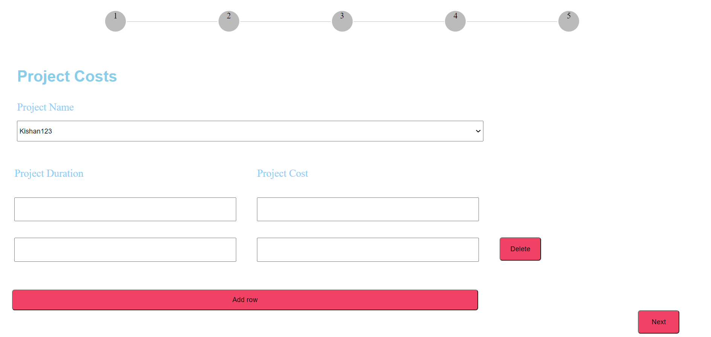

# Tatvaproject

This project was generated with [Angular CLI](https://github.com/angular/angular-cli) version 7.0.3.

## Development server

Run `ng serve` for a dev server. Navigate to `http://localhost:4200/`. The app will automatically reload if you change any of the source files.

## Code scaffolding

Run `ng generate component component-name` to generate a new component. You can also use `ng generate directive|pipe|service|class|guard|interface|enum|module`.

## Build

Run `ng build` to build the project. The build artifacts will be stored in the `dist/` directory. Use the `--prod` flag for a production build.

## Running unit tests

Run `ng test` to execute the unit tests via [Karma](https://karma-runner.github.io).

## Running end-to-end tests

Run `ng e2e` to execute the end-to-end tests via [Protractor](http://www.protractortest.org/).

## Further help

To get more help on the Angular CLI use `ng help` or go check out the [Angular CLI README](https://github.com/angular/angular-cli/blob/master/README.md).
## Get started

## Making Components:
Here I have made five diffrent components for 4 different screen + one component for Top Nav :
TopnavComponent-- top nav bar
ProjectdtlsComponent--screen-1
ProjectcostComponent--screen-2
ProjectdatesComponent--screen-3
ProjectgalleryComponent--screen-4
Importance-- code can easily be managed and can be reused.

## Adding Routing
Moving from one component to another is done using Angular Routing.For this I have added path and component in app-routing.module.ts.
Click function called on top nav menu that is actually swiching these components using Router class.

## Angular Material
Here date field can be implemented using Angular Date picker. This is part of Angular material.

### Screenshots of screens

